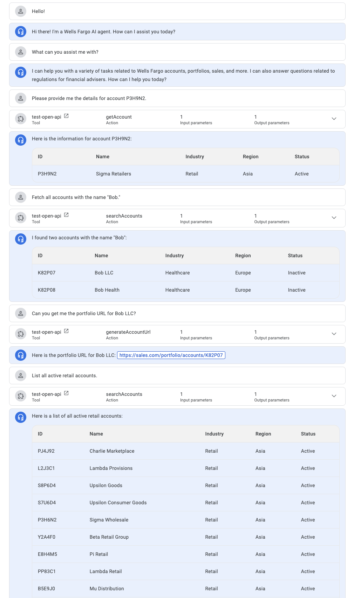

# AIQueryAgent

AI agent capable of querying a mock sales database via a RESTful API to fetch and analyze customer-centric data.



## Tools and Services

- GCP Vertex AI Agent Builder
- Cloud Functions

## Steps to Setup and Replicate Workflow

### 1. Clone the Repository

```bash
git clone https://github.com/arunpshankar/AIQueryAgent.git
cd AIQueryAgent
```

### 2. Create and Activate Virtual Environment

```bash
python -m venv venv
source venv/bin/activate
```

### 3. Install Requirements

```bash
pip install -r requirements.txt
export PYTHONPATH=$PYTHONPATH:.
```

### 4. Project Structure

The project contains `src/` with two packages:

- `app/`
- `dev/`

### 5. Setup and Populate Database

Navigate to `dev/` and run `db_setup.py`:

```bash
python src/dev/db_setup.py
```

This script loads and populates the mock sales data `sales.csv` from the `data` folder and creates a SQLite database under `data/` called `sales.db`.

### 6. Test Database

Run `db_test.py` to check data retrieval from the database:

```bash
python src/dev/db_test.py
```

### 7. Setup Flask Server

`app_server.py` sets up a localhost Flask server with GET methods to retrieve accounts by name (partial string match) and ID. Run this to start the server:

```bash
python src/app/app_server.py
```

### 8. Test GET Methods

Run `app_client.py` to test if the GET methods are functioning properly:

```bash
python src/app/app_client.py
```

### 9. Prepare for Cloud Deployment

Prepare everything needed to deploy the Flask server alongside the SQLite database to Cloud Functions. Based on `app_server.py`, create a `main.py` inside `/app`:

- Ensure no `app.run()` is needed; Cloud Functions handle the server setup.
- Use `dispatch_request` instead.

Copy `requirements.txt` and `sales.db` into the `/app` folder.

### 10. Deploy to Cloud Functions

From the `dev` directory, run `deploy.ipynb` notebook. Ensure you have `gcloud CLI` installed.

You can test the deployment using `CURL` with the Cloud Function URL to see if GET API calls are functioning as expected.

### 11. Create OpenAPI Specification

Create an OpenAPI spec similar to the example in `./data/sales.yml`.

### 12. Set Up Agent

Use the OpenAPI spec to set up the agent under Agent Builder. The spec is used to create a tool, and the agent uses this tool to communicate with the Cloud Function to retrieve account-specific information.

**Note:** Set auth type to API key as shown below in the console. 


**Examples** of questions to ask the agent in each turn:

- hi
- please provide the details for P3H9N2
- fetch all accounts associated with the name - Bob
- show me both side by side (as a markdown)
- list all accounts that are active
- how many are there in total?
- get counts by industry type

---